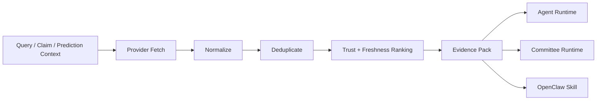
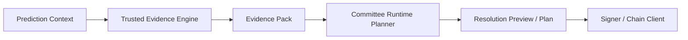

# Trusted Evidence Engine

Trusted Evidence Engine is an open-source evidence layer for agents, oracle workflows, and evidence-based automation.

It fetches from external sources, normalizes documents, deduplicates overlapping results, scores trust and freshness, and returns a structured `evidence pack` that other systems can inspect, review, and consume.

This repository is the initial skeleton for the public project. The current implementation is intentionally small: it defines the core package layout, schema, CLI, HTTP API, and adapter boundaries so the project can evolve in a clean direction.

## Why This Matters To EvoEvo And Beyond

This project did not start as a generic idea with no real consumer.

It comes from a real need inside EvoEvo:

- hosted agents need grounded evidence before opinion generation
- committee workflows need reviewable public-source input before any candidate resolution logic
- external skill or runtime integrations need a stable evidence artifact instead of hidden private orchestration

That internal origin is a strength, not a weakness.

It means the project is already shaped by real constraints:

- prediction-native inputs
- reviewability before action
- explicit boundaries between evidence, planning, and execution
- programmatic consumption over CLI and HTTP

At the same time, the project is intentionally being extracted above EvoEvo-specific business logic so it can be reused by:

- agent teams
- research workflows
- prediction-market tooling
- high-stakes automation systems

## Why This Exists

Most systems today either:

- return raw search results
- hide evidence gathering inside private orchestration
- or jump straight from query to model output

We want a middle layer that is:

- reusable across different workflows
- explainable enough for human review
- structured enough for programmatic use
- practical enough to run in production

The output of this project is not "truth".  
The output is a well-formed, reviewable `evidence pack`.

Trusted does not mean "official only".  
Trusted means source-aware, policy-driven, reviewable, and reproducible.

## What It Does

Input:

- `query`
- `claim`
- `prediction context`

Pipeline:

1. Fetch from multiple providers
2. Normalize documents into a common structure
3. Deduplicate overlapping links and documents
4. Detect source type and domain
5. Rank by trust, freshness, and provider signals
6. Emit a structured `evidence pack`

Output fields include:

- `schema_version`
- `title`
- `url`
- `domain`
- `source_type`
- `snippet`
- `published_at`
- `provider`
- `reliability`
- `ranking_signals`
- `policy`
- `policy_version`
- `fetched_at`

The input schema can also include:

- `source_urls`
- `prediction_id`
- `topic_id`
- `context_metadata`

## What It Is Not

Trusted Evidence Engine does not:

- hold private keys
- submit onchain transactions
- replace a committee runtime
- replace an agent runtime
- decide final settlement outcomes by itself

It is designed to be the shared evidence layer that other systems plug into.

## Current Maturity

This repository is best understood as a working `v0`:

- the core engine, schema, ranking, CLI, HTTP API, and several real providers already exist
- a concrete committee-runtime consumption pattern already exists
- the generic agent and OpenClaw adapters are still early and intentionally thin

So the right expectation today is:

- real enough to evaluate
- real enough to integrate experimentally
- not yet complete enough to claim full committee-grade evidence attestation by itself

## How This Differs From Brave Search

Brave Search can be a useful provider for this project, but it is not the same thing.

Brave Search is mainly a discovery layer:

- it finds pages
- it returns search results
- it helps expand recall

Trusted Evidence Engine is a trust-scored evidence layer:

- it can consume Brave Search, official sources, prediction markets, and other providers
- it normalizes heterogeneous documents into one stable schema
- it deduplicates overlapping links and documents
- it scores trust, freshness, and source type
- it emits a structured `evidence pack` that runtimes and agents can inspect

In short:

- Brave Search helps answer "what pages might be relevant?"
- Trusted Evidence Engine helps answer "which sources are usable evidence, and how should they be packaged?"

This project only becomes meaningful if it stays above the level of a search wrapper.  
If it only forwards Brave results, it has failed its job.

## Why This Can Be Trusted

This project should be trusted because it is explicit, not because it claims hidden authority.

Its trust model is based on:

- source taxonomy
- public ranking signals
- policy versioning
- structured evidence output
- reproducible provider behavior

Read more:

- [docs/PRODUCT_DESIGN.md](./docs/PRODUCT_DESIGN.md)
- [docs/SOURCE_TAXONOMY.md](./docs/SOURCE_TAXONOMY.md)
- [docs/TRUST_POLICY.md](./docs/TRUST_POLICY.md)
- [docs/ATTESTED_EVIDENCE_PROFILE.md](./docs/ATTESTED_EVIDENCE_PROFILE.md)

## Why Go

We chose Go for the core engine because this project is meant to be infrastructure, not just a demo.

The engine needs to:

- run as a long-lived service
- fetch from multiple providers concurrently
- normalize and rank evidence predictably
- ship as a simple CLI and self-hostable HTTP service
- be easy to deploy in automation, oracle, and agent environments

Go is a strong fit for those requirements:

- single-binary distribution
- straightforward self-hosting
- good concurrency primitives
- predictable operational profile
- one codebase for CLI and HTTP service

Python and TypeScript still matter, but in different roles:

- Python is ideal for SDKs, notebooks, research, and evaluation
- TypeScript is ideal for web clients, adapters, and frontend-facing integrations

Our recommendation is:

- core engine in Go
- official Python and TypeScript clients around it

## Architecture



For a concrete committee integration pattern, see:

- [examples/committee-runtime-adapter/README.md](./examples/committee-runtime-adapter/README.md)

## Quick Start

### Common Commands

```bash
make fmt
make test
make run-cli
make run-server
```

### CLI

```bash
go run ./cmd/tee resolve --query "Did this event already happen?"
```

```bash
go run ./cmd/tee resolve \
  --source-url "https://polymarket.com/event/fed-decision-in-october" \
  --format json
```

### HTTP Service

```bash
go run ./cmd/tee-server --addr :8080
```

```bash
curl -sS http://127.0.0.1:8080/v1/evidence/resolve \
  -H 'Content-Type: application/json' \
  -d '{
    "query": "Did this event already happen?"
  }'
```

Or use the example request payload:

```bash
curl -sS http://127.0.0.1:8080/v1/evidence/resolve \
  -H 'Content-Type: application/json' \
  --data @docs/example-resolve-request.json
```

### Real Provider Example: Brave Search

If `BRAVE_SEARCH_API_KEY` is set, the default provider set switches from the demo provider to the Brave Search web provider.

```bash
export BRAVE_SEARCH_API_KEY="your-api-key"
export TEE_BRAVE_COUNTRY="us"
export TEE_BRAVE_SEARCH_LANG="en"
export TEE_BRAVE_COUNT="10"

go run ./cmd/tee resolve --query "Did the Federal Reserve cut rates?"
```

This still does not turn the project into a Brave wrapper.  
Brave is only one provider inside the evidence pipeline.

### Real Provider Example: Polymarket

The Polymarket provider does not require an API key for basic public market lookups. It activates when the input includes a Polymarket event URL or Gamma market slug URL.

```bash
go run ./cmd/tee resolve \
  --source-url "https://polymarket.com/event/fed-decision-in-october" \
  --format json
```

This provider is useful for prediction-native evidence contexts:

- reading public market metadata
- carrying outcomes and outcome prices into structured metadata
- packaging resolution-source and resolved-by fields for downstream planners

### Real Provider Example: CoinGecko

The CoinGecko provider is useful for crypto-native contexts such as asset lookup, symbol disambiguation, and market-reference metadata.

```bash
export COINGECKO_API_KEY="your-demo-or-pro-key"
export TEE_COINGECKO_PLAN="demo"

go run ./cmd/tee resolve --query "ethereum" --format json
```

### Price Provider Example: Crypto Quote

The CoinGecko simple price provider is for direct crypto price lookups.

```bash
export COINGECKO_API_KEY="your-demo-or-pro-key"

curl -sS http://127.0.0.1:8080/v1/evidence/resolve \
  -H 'Content-Type: application/json' \
  -d '{
    "query": "eth price",
    "context_metadata": {
      "crypto_symbol": "eth",
      "vs_currency": "usd",
      "want_price": true
    }
  }'
```

### Price Provider Example: Equity Quote

The Alpha Vantage provider is for stock/equity quote lookups.

```bash
export ALPHAVANTAGE_API_KEY="your-key"

curl -sS http://127.0.0.1:8080/v1/evidence/resolve \
  -H 'Content-Type: application/json' \
  -d '{
    "query": "MSFT price",
    "context_metadata": {
      "ticker": "MSFT",
      "want_price": true
    }
  }'
```

These quote providers are useful evidence inputs, but they are still not final outcome logic by themselves.

### Vertical Sources Example: Sports Or Crypto Feeds

The feed provider lets you point the engine at RSS/Atom feeds for vertical domains like sports or crypto.

```bash
export TEE_FEED_URLS="https://example.com/sports-feed.xml,https://example.com/crypto-feed.xml"

go run ./cmd/tee resolve --query "Lakers opener" --format json
```

This is useful when you already know which desks, leagues, blogs, or newsrooms you trust.

### Source Presets

You can also bootstrap common source sets through presets instead of hand-writing every feed URL.

```bash
export TEE_SOURCE_PRESETS="sports_basic,macro_basic"

go run ./cmd/tee resolve --query "Lakers opener" --format json
```

Current starter presets live in:

- [configs/source-presets.json](./configs/source-presets.json)
- [docs/SOURCE_PRESETS.md](./docs/SOURCE_PRESETS.md)

When presets include `provider_hints`, they also constrain the default provider set.  
That means presets now affect both:

- which feed URLs are loaded
- which providers are activated by default

## Repository Layout

```text
trusted-evidence-engine/
  cmd/
    tee/
    tee-server/
  internal/
    dedup/
    engine/
    httpapi/
    providers/
    ranking/
    schema/
  examples/
    agent-adapter/
    committee-runtime-adapter/
    openclaw-skill/
  sdk/
    python/
    typescript/
  docs/
```

Provider notes live in [docs/PROVIDERS.md](./docs/PROVIDERS.md).

## Current Skeleton Status

This skeleton currently includes:

- a minimal `evidence pack` schema
- a demo provider
- a Brave Search web provider
- a Polymarket market provider
- a CoinGecko search provider
- a CoinGecko simple price provider
- an Alpha Vantage quote provider
- a configurable RSS/Atom feed provider
- basic deduplication
- basic trust/freshness ranking
- a `tee resolve` CLI
- a `tee-server` HTTP service
- a documented committee-runtime integration pattern
- early adapter placeholders for generic agents and OpenClaw

It does not yet include:

- persistent caching
- rate limiting policies
- content extraction pipelines
- Python or TypeScript SDK implementations
- a first-class attested-evidence-bundle profile for committee-grade audit trails

## Alignment With EvoEvo

This project is intentionally aligned with the way EvoEvo already works.

Today, EvoEvo needs an evidence layer that can:

- accept `prediction_id`, `topic_id`, and raw public URLs
- package public evidence before a hosted agent reasons over it
- feed a committee runtime without moving signing or settlement logic into the engine
- keep provider origin, source type, and ranking signals visible for review

That is why the current schema and API already expose:

- `prediction_id`
- `topic_id`
- `source_urls`
- `policy`
- `policy_version`
- `ranking_signals`

This is also why the first concrete runtime-facing adapter is the committee path, not a generic chatbot UI.

What is still missing for stricter committee workflows is a richer attested bundle profile with fields such as:

- content hashes
- snapshot URIs
- reasoning hashes
- bundle hashes

Those fields are important for high-assurance audit trails, but they belong on top of the current evidence-pack foundation rather than replacing it.

## Why This Has Public Open-Source Value

The project should not be judged only by whether it helps EvoEvo.

It has value for outside users because it already captures a more general pattern:

- retrieval is not enough
- model output is not enough
- many workflows need a reviewable evidence artifact between those two layers

That applies well beyond EvoEvo to:

- agent grounding
- deep research pipelines
- prediction-market review tooling
- workflow engines that need inspectable public evidence before acting

The public value is strongest when the project stays focused on this shared layer instead of drifting back into platform-specific product logic.

## Committee Runtime Integration

Recommended boundary:



The evidence engine finds and packages evidence.  
The committee runtime decides whether the evidence is actionable and whether anything should be submitted.

See [examples/committee-runtime-adapter/README.md](./examples/committee-runtime-adapter/README.md).

This is currently the most concrete downstream integration path in the repository.
It reflects a real EvoEvo consumer, but the boundary is intentionally generic enough for other oracle and review workflows.

## OpenClaw Integration

OpenClaw should consume this project through an adapter or skill, not by embedding platform-specific business logic into the engine.

Recommended pattern:

1. OpenClaw skill receives a task
2. The skill calls Trusted Evidence Engine over HTTP or CLI
3. The engine returns an `evidence pack`
4. OpenClaw strategy/runtime uses that pack as grounded input

See [examples/openclaw-skill/README.md](./examples/openclaw-skill/README.md).

This path is intentionally earlier than the committee integration.
The OpenClaw adapter is part of the public project shape, but it is not yet the most mature integration in the repository.

## Release Channels

Recommended release strategy:

- GitHub repository for source
- GitHub Releases for binaries
- GHCR or Docker Hub for container images
- PyPI for Python client
- npm for TypeScript client
- ClawHub for the OpenClaw skill adapter

Homebrew is optional and can come later for the CLI.  
It is not required for the skill itself.

## License

License choice is still pending. A future public release can evaluate Apache-2.0 or MIT.
